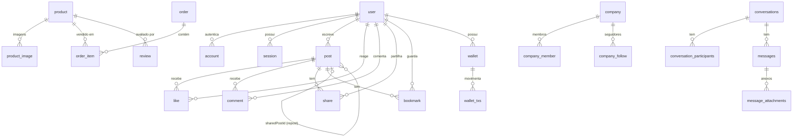

# NOkubico — Backend

<p align="center">
  <strong>Plataforma Digital de Marketplace Multimédia</strong>
</p>

API backend do **NOkubico**: um ecossistema seguro e inteligente para **compra, venda e negociação de conteúdos multimédia** produzidos por criadores angolanos (design, vídeo, fotografia, modelagem 3D e multimédia em geral).

---

## Índice

- [1. Visão Geral](#1-visão-geral)
- [2. Origem e Contexto (Ficha Técnica)](#2-origem-e-contexto-ficha-técnica)
- [3. Funcionalidades](#3-funcionalidades)
- [4. Arquitetura (DDD / Clean Architecture)](#4-arquitetura-ddd--clean-architecture)
- [5. Tecnologias e Ferramentas](#5-tecnologias-e-ferramentas)
- [6. Como Executar](#6-como-executar)
- [7. Base de Dados](#7-base-de-dados)
  - [7.1 Convenções PostgreSQL](#71-convenções-postgresql)
  - [7.2 Diagrama de Relacionamentos](#72-diagrama-de-relacionamentos)
  - [7.3 Porque algumas tabelas não têm `id`](#73-porque-algumas-tabelas-não-têm-id)
  - [7.4 Módulo: Utilizadores e Autenticação](#74-módulo-utilizadores-e-autenticação)
  - [7.5 Módulo: Postagens e Comunidade](#75-módulo-postagens-e-comunidade)
  - [7.6 Módulo: Marketplace de Produtos](#76-módulo-marketplace-de-produtos)
  - [7.7 Módulo: Carteira e Pagamentos](#77-módulo-carteira-e-pagamentos)
  - [7.8 Módulo: Conversas e Mensagens](#78-módulo-conversas-e-mensagens)
  - [7.9 Módulo: Empresas](#79-módulo-empresas)
  - [7.10 Tabelas Planeadas (MVP completo)](#710-tabelas-planeadas-mvp-completo)
- [8. Fluxos Funcionais](#8-fluxos-funcionais)
- [9. Estado Atual e Roadmap](#9-estado-atual-e-roadmap)
- [10. Documentação de Referência](#10-documentação-de-referência)

---

## 1. Visão Geral

O **NOkubico** é uma plataforma digital que funciona como um marketplace multimédia onde **criadores** (vendedores) e **clientes** (compradores) podem comprar, vender e negociar conteúdos e serviços nas áreas de:

- Design gráfico
- Vídeo / Motion
- Fotografia
- Modelagem 3D
- Multimédia em geral

A plataforma integra um **sistema de pagamento seguro baseado em escrow**: o pagamento do comprador fica retido na carteira digital e **só é libertado ao vendedor após a confirmação da entrega pelo comprador**. O sistema inclui ainda perfis públicos com portfólio, reputação e avaliações, uma área de comunidade inspirada em redes profissionais, chat de negociação e um agente de **Inteligência Artificial** que auxilia vendedores na definição de preços, descontos e propostas comerciais.

Este repositório contém exclusivamente o **backend** da plataforma, seguindo os princípios de **Domain-Driven Design (DDD)** e **Clean Architecture**.

---

## 2. Origem e Contexto (Ficha Técnica)

Baseado na **Ficha Técnica NoKubico** (`Ficha técnica NoKubico.pdf`):

| Campo | Descrição |
|-------|-----------|
| **Startup** | KUZOLA STUDIO |
| **Representante** | Leocaldio Carlos |
| **Estado** | Em desenvolvimento (MVP em definição) |
| **Objetivo** | Desenvolver uma plataforma digital que funcione como um ecossistema seguro e inteligente para compra, venda e negociação de conteúdo multimédia produzidos por criadores angolanos, promovendo a economia criativa através de tecnologia, transparência e confiança |
| **Problema a resolver** | Criadores multimédia angolanos enfrentam dificuldades em monetizar os seus serviços de forma segura, profissional e escalável, devido à ausência de plataformas com boa visibilidade e à inexistência de mecanismos inteligentes de precificação e negociação |
| **Impacto no país** | Impulsiona a economia criativa nacional, gera oportunidades de renda para jovens profissionais, profissionaliza o mercado de serviços digitais, reduz fraudes em transações online e posiciona Angola como produtor de soluções tecnológicas inovadoras no setor criativo |

---

## 3. Funcionalidades

Mapeamento dos requisitos funcionais (RF) da ficha técnica:

### 3.1 Autenticação
- **RF001** — Autenticação de utilizadores via email e senha, com opção de **OAuth**.

### 3.2 Usuário Comprador
- **RF002** — Visualizar anúncios/produtos multimédia.
- **RF003** — Iniciar conversas privadas com vendedores.
- **RF004** — Realizar pagamentos através de carteira digital com escrow.
- **RF005** — Confirmar entregas, libertando o pagamento.
- **RF006** — Abrir disputas antes da liberação do pagamento.
- **RF007** — Avaliar vendedores após a conclusão do pedido.

### 3.3 Usuário Vendedor
- **RF008** — Criar perfis públicos com portfólio.
- **RF009** — Criar e gerir anúncios/produtos multimédia.
- **RF010** — Enviar arquivos ou links como prova de entrega.
- **RF011** — Acompanhar histórico de pedidos e saldo da carteira.
- **RF012** — Receber sugestões de preço e desconto através do agente de IA.

### 3.4 Comunidade
- **RF013** — Criação de posts, comentários e curtidas.
- **RF014** — Reportar conteúdo da comunidade.

### 3.5 Administrador
- **RF015** — Moderação de utilizadores, anúncios e conteúdo da comunidade.
- **RF016** — Gestão de disputas com acesso a evidências (chat, arquivos, logs).
- **RF017** — Relatórios de transações, desempenho e uso da plataforma.

---

## 4. Arquitetura (DDD / Clean Architecture)

O projeto segue **Domain-Driven Design** com separação em camadas (Clean Architecture): o **Domínio** não conhece a infraestrutura; a infraestrutura implementa os contratos definidos pelo domínio; a **API** apenas orquestra e expõe.

```
┌─────────────────────────────────────────────────────────────┐
│  Nokubico.API          → Apresentação (Controllers, Swagger)│
│  Nokubico.Application  → Casos de uso (DTOs, Serviços)      │
│  Nokubico.Domain       → Entidades, Enums (regras de negócio)│
│  Nokubico.Infra.Data   → EF Core, DbContext, Configurations  │
│  Nokubico.Infra.Ioc    → Composição Root (Registo de DI)     │
└─────────────────────────────────────────────────────────────┘
```

### 4.1 Nokubico.API

Camada de **apresentação**. Responsável apenas por receber pedidos HTTP, delegar para a aplicação e devolver respostas.

| Pasta / Ficheiro | Função |
|------------------|--------|
| `Controllers/` | Endpoints REST (atualmente com o template `WeatherForecastController`, a substituir) |
| `Program.cs` | Bootstrap da aplicação: DI, Swagger, pipeline HTTP |
| `appsettings.json` / `appsettings.Development.json` | Configuração (logging, connection string) |
| `Nokubico.API.http` | Exemplos de pedidos HTTP |

### 4.2 Nokubico.Application

Camada de **aplicação / casos de uso**. Orquestra operações de negócio usando entidades do domínio e expõe DTOs. **Não contém regras de negócio nem acesso direto à base de dados.**

> Estrutura prevista (a preencher): `DTOs/`, `Interfaces/`, `Services/`, `Mapping/`.

### 4.3 Nokubico.Domain

Camada de **domínio**, o coração do negócio. Contém apenas entidades, enums e regras de negócio, **sem dependências externas** (nenhum package).

| Pasta | Função |
|-------|--------|
| `Entities/` | Entidades do negócio (ver secção [7. Base de Dados](#7-base-de-dados)) |
| `Enums/` | `UserRole`, `ProductStatus`, `WalletStatus` |

As entidades seguem o padrão **encapsulado** (props com `private set`) e expõem **métodos de comportamento** (`SetName`, `VerifyEmail`, `AddLike`, `Touch()`, …) em vez de setters públicos, garantindo que as regras sejam aplicadas no próprio domínio. Todas herdam de `BaseEntity` (fornece `Id`, `CreatedAt`, `UpdatedAt` e `Touch()`).

### 4.4 Nokubico.Infra.Data

Camada de **infraestrutura de dados**. Implementa o mapeamento objeto-relacional com **Entity Framework Core**.

| Pasta / Ficheiro | Função |
|------------------|--------|
| `Context/AppDbContext.cs` | O `DbContext` principal; expõe os `DbSet` de todas as entidades |
| `Configurations/` | Mapeamento Fluent API por entidade (tabela, chaves, índices, FKs, defaults) |
| `Migrations/` | Migrações geradas pelo EF Core (ainda **vazia** — a primeira migração está por criar) |

### 4.5 Nokubico.Infra.Ioc

Camada de **Composição Root** (Inversão de Controlo). Regista as dependências da infraestrutura na DI (ex.: `AddDbContext<AppDbContext>`). É referenciada apenas pela API.

### 4.6 HealthIA.Domain (resíduo)

A pasta `HealthIA.Domain/` é um **resíduo do projeto de referência HeathIA** (`Paciente`, `DomainExceptionValidation`) e **não faz parte da solução** `Nokubico.slnx`. Deve ser **removida** antes de criar migrações ou fazer commit.

---

## 5. Tecnologias e Ferramentas

| Categoria | Tecnologia |
|-----------|------------|
| **Framework** | ASP.NET Core 10 (net10.0) |
| **Linguagem** | C# |
| **ORM** | Entity Framework Core 10 |
| **Base de Dados** | PostgreSQL (Npgsql) |
| **Documentação** | Swagger / OpenAPI (Swashbuckle) |
| **Arquitetura** | DDD / Clean Architecture |

Tecnologias previstas pela ficha técnica (a integrar):

- Front-end: React + Next.js, Tailwind CSS, Shadcn UI, Three.js
- Armazenamento de ficheiros: AWS S3 ou MinIO
- Busca: Algolia ou Elasticsearch
- Pagamentos: Stripe, Flutterwave ou gateway local
- Chat/Notificações em tempo real: SignalR ou Socket.IO
- IA: API de LLM para sugestões de preço, descrições e apoio à negociação (com guardrails para limitar descontos)

---

## 6. Como Executar

### Pré-requisitos

- [.NET 10 SDK](https://dotnet.microsoft.com/download)
- [PostgreSQL](https://www.postgresql.org/download/)
- Ferramenta global `dotnet-ef` (para gerir migrações)

### Passos

1. **Instale a ferramenta EF Core** (se ainda não tiver):
   ```bash
   dotnet tool install --global dotnet-ef
   ```

2. **Configure a connection string** em `Nokubico.API/appsettings.Development.json` (já definida por omissão):
   ```json
   "ConnectionStrings": {
     "DefaultConnection": "Host=localhost;Port=5432;Database=nokubico_local;Username=postgres;Password=SUA_PASSWORD"
   }
   ```

3. **Crie a primeira migração** (a pasta `Migrations/` está vazia):
   ```bash
   dotnet ef migrations add InitialCreate --project Nokubico.Infra.Data --startup-project Nokubico.API
   ```

4. **Aplique as migrações ao banco de dados**:
   ```bash
   dotnet ef database update --project Nokubico.Infra.Data --startup-project Nokubico.API
   ```

5. **Inicie a aplicação**:
   ```bash
   dotnet run --project Nokubico.API
   ```

6. **Acesse a documentação Swagger**:
   ```
   https://localhost:7295/swagger
   ```
   (perfil de execução definido em `Properties/launchSettings.json`)

> O fluxo de execução (instalar dotnet-ef → migrar → correr) é o mesmo usado no projeto de referência **HeathIA**, porém com um modelo de entidades mais rico e organizado.

---

## 7. Base de Dados

### 7.1 Convenções PostgreSQL

| Convenção | Regra |
|-----------|-------|
| **Nomes** | `snake_case` no banco; os nomes `camelCase` no código representam o modelo lógico |
| **Chaves** | `uuid` com `gen_random_uuid()` como default |
| **Datas** | `timestamptz` (UTC), nunca `timestamp` sem timezone |
| **Moeda** | `bigint` em unidades mínimas da moeda (cêntimos), nunca `float`; `currency` como `char(3)` ISO 4217 (ex.: `USD`, `KZ`) |
| **Textos/URLs** | `text` reservado para conteúdo livre, URLs e referências externas |
| **Integridade** | FKs sempre apontam para PK/UK; `ON DELETE CASCADE` em tabelas de ligação; `ON DELETE RESTRICT` em histórico financeiro/pedidos |
| **NOT NULL** | Campos obrigatórios sempre `NOT NULL`; `CHECK` para valores monetários positivos e limites de rating |

> Estado atual: várias colunas de relação (ex.: `Post.AuthorId`, `Like.UserId/PostId`) estão representadas como **colunas simples (`Guid`)** e ainda não possuem constraints de FK configuradas em `Nokubico.Infra.Data/Configurations`. A configuração completa de relacionamentos e `ON DELETE` está prevista no roadmap. Já estão configurados relacionamentos explícitos em: `User → Account`, `User → Session`, `Product → ProductImage`, `Wallet → WalletTx`.

### 7.2 Diagrama de Relacionamentos



### 7.3 Porque algumas tabelas não têm `id`

Nem toda tabela precisa de uma chave substituta (surrogate `id`). A regra usada é:

- **Agregados / entidades de negócio** (`user`, `post`, `product`, `order`, `wallet`, `conversation`, `company`, …) têm `id` próprio porque são referenciados por outras tabelas e existem de forma independente.
- **Tabelas de detalhe ou de associação** representam *a relação entre duas entidades* — a sua identidade **é** a combinação das chaves estrangeiras. Criar um `id` artificial além do par seria redundante e abriria a porta a duplicados (o mesmo par de FKs com ids diferentes).

Exemplos no modelo atual e no schema planeado:

| Tabela | Chave | Justificativa |
|--------|-------|---------------|
| `product_image` | Composta `(productId, imageUrl)` | Detalhe dependente do produto; a identidade é o produto + URL da imagem |
| `like` | `UNIQUE(userId, postId)` | Um utilizador só pode gostar de um post **uma vez**; a unicidade nasce da combinação |
| `review` | `UNIQUE(productId, userId)` | Um utilizador só avalia um produto **uma vez** |
| `conversation_participants` | `UNIQUE(conversationId, userId)` | Associação N:N entre conversas e utilizadores |
| `company_member` / `company_follow` | `UNIQUE(companyId, userId)` | Associação N:N entre empresa e utilizador |
| `user_skill`, `job_skill`, `creative_request_skill` *(planeadas)* | PK composta pelos dois IDs | Junções N:N entre entidades e skills |

**Como as tabelas dependem umas das outras:** todas as entidades de detalhe/associação dependem das suas tabelas-pai. Um `like` só existe se o `user` e o `post` existirem; um `wallet_txs` só existe dentro de um `wallet`; um `order_item` pertence a um `order` e referencia um `product`. É por isso que o `ON DELETE CASCADE` é aplicado às associações (apagar o pai apaga os filhos) e o `ON DELETE RESTRICT` ao histórico financeiro (`wallet_txs`), que é **imutável**.

---

### 7.4 Módulo: Utilizadores e Autenticação

Responsável por contas, sessões e autenticação (email/senha e OAuth futuro).

#### `user`

| Atributo | Tipo | Descrição |
|----------|------|-----------|
| `id` | uuid PK | Identificador único do utilizador |
| `email` | varchar(255) NOT NULL UNIQUE | Email de login |
| `name` | varchar(120) NOT NULL | Nome completo |
| `image` | text NULL | URL do avatar (armazenado em S3/MinIO; o banco guarda apenas a URL) |
| `bio` | text NULL | Biografia do perfil |
| `location` | text NULL | Localização geográfica |
| `profession` | text NULL | Profissão (ex.: designer, videógrafo) |
| `role` | int (enum `UserRole`) | `User` ou `Admin` (permite `COMPANY` no schema planeado) |
| `emailVerified` | bool NOT NULL | Se o email foi verificado |
| `createdAt` / `updatedAt` | timestamptz | Controlo de datas |

#### `account`

Liga um utilizador a um **provider** de autenticação (email/senha ou OAuth externo).

| Atributo | Tipo | Descrição |
|----------|------|-----------|
| `id` | uuid PK | Identificador da conta |
| `accountId` | text NOT NULL | Identificador do utilizador no provider externo |
| `providerId` | text NOT NULL | Nome do provider (`email`, `google`, `github`, …) |
| `userId` | uuid FK → `user.id` | Utilizador dono da conta |
| `accessToken` | text NULL | Token de acesso do provider |
| `refreshToken` | text NULL | Token de renovação do provider |
| `password` | text NULL | Hash da senha (bcrypt/Argon2) usado quando o provider é `email` |
| `createdAt` / `updatedAt` | timestamptz | Controlo de datas |

`UNIQUE (providerId, accountId)` garante que um provider não duplica contas.

#### `session`

Representa uma sessão autenticada (login).

| Atributo | Tipo | Descrição |
|----------|------|-----------|
| `id` | uuid PK | Identificador da sessão |
| `expiresAt` | timestamptz NOT NULL | Momento em que a sessão expira |
| `token` | text NOT NULL UNIQUE | Token da sessão (JWT ou equivalente) |
| `createdAt` | timestamptz | Data de criação |
| `userId` | uuid FK → `user.id` | Utilizador autenticado |

**Relações:** `user 1 → N account`, `user 1 → N session`.

---

### 7.5 Módulo: Postagens e Comunidade

Área de comunidade do NOkubico (RF013/RF014): posts, curtidas, comentários, partilhas e favoritos.

#### `post`

| Atributo | Tipo | Descrição |
|----------|------|-----------|
| `id` | uuid PK | Identificador do post |
| `content` | text NULL | Texto da publicação |
| `image` | text NULL | URL da imagem (o ficheiro é guardado em S3/MinIO; aqui só a URL) |
| `video` | text NULL | URL do vídeo (o ficheiro é guardado em S3/MinIO; aqui só a URL) |
| `authorId` | uuid | Utilizador autor do post |
| `sharedPostId` | uuid NULL | Se for um **repost**, aponta para o post original |
| `createdAt` / `updatedAt` | timestamptz | Controlo de datas |

**Onde ficam as imagens/vídeos:** o banco guarda apenas **URLs** (`image`, `video`). Os ficheiros binários são carregados para armazenamento de objetos (AWS S3 ou MinIO) e o backend devolve o URL público.

#### `like`

| Atributo | Tipo | Descrição |
|----------|------|-----------|
| `id` | uuid PK | Identificador do gosto |
| `userId` | uuid | Quem gostou |
| `postId` | uuid | Post alvo |
| `createdAt` | timestamptz | Data do gosto |

`UNIQUE (userId, postId)` — um utilizador só pode gostar do mesmo post uma vez (toggling do like).

#### `comment`

| Atributo | Tipo | Descrição |
|----------|------|-----------|
| `id` | uuid PK | Identificador do comentário |
| `content` | text | Texto do comentário |
| `authorId` | uuid | Autor do comentário |
| `postId` | uuid | Post comentado |
| `createdAt` / `updatedAt` | timestamptz | Controlo de datas |

#### `share`

| Atributo | Tipo | Descrição |
|----------|------|-----------|
| `id` | uuid PK | Identificador da partilha |
| `userId` | uuid | Utilizador que partilhou |
| `postId` | uuid | Post partilhado |
| `createdAt` | timestamptz | Data da partilha |

`UNIQUE (userId, postId)` — partilha registada apenas uma vez por utilizador/post.

#### `bookmark`

| Atributo | Tipo | Descrição |
|----------|------|-----------|
| `id` | uuid PK | Identificador do marcador |
| `userId` | uuid | Utilizador que guardou |
| `postId` | uuid | Post guardado |
| `createdAt` | timestamptz | Data do marcador |

`UNIQUE (userId, postId)` — permite guardar/desguardar (favoritos).

**Relações:** `user 1 → N post`, `post 1 → N like/comment/share/bookmark`.

---

### 7.6 Módulo: Marketplace de Produtos

Vendedores criam anúncios (produtos multimédia) que os compradores podem comprar (RF002, RF009, RF010, RF011, RF007).

#### `product`

| Atributo | Tipo | Descrição |
|----------|------|-----------|
| `id` | uuid PK | Identificador do produto |
| `title` | text | Título do anúncio |
| `slug` | text | Identificador amigável para URL |
| `description` | text NULL | Descrição do produto |
| `category` | text | Categoria (design, vídeo, fotografia, 3D, …) |
| `price` | bigint NOT NULL | Preço em unidades mínimas (cêntimos), `CHECK (price >= 0)` |
| `currency` | char(3) NOT NULL | Moeda (ISO 4217) |
| `thumbnail` | text | URL da imagem de capa |
| `license` | text | Tipo de licença do conteúdo |
| `downloadUrl` | text NULL | URL de download do ficheiro (S3/MinIO) |
| `creatorId` | uuid | Utilizador vendedor |
| `status` | int (enum `ProductStatus`) | `Draft`, `Published`, `Disabled` (schema planeado: `PENDING/APPROVED/REJECTED`) |
| `createdAt` / `updatedAt` | timestamptz | Controlo de datas |

#### `product_image`

| Atributo | Tipo | Descrição |
|----------|------|-----------|
| `productId` | uuid PK (composta) | Produto dono da imagem |
| `imageUrl` | text PK (composta) | URL da imagem |
| `position` | smallint NOT NULL | Ordem de exibição (galeria) |

`UNIQUE (productId, position)` — evita duas imagens na mesma posição. Esta tabela substitui um eventual array `images`, mantendo a **primeira forma normal**.

#### `order`

| Atributo | Tipo | Descrição |
|----------|------|-----------|
| `id` | uuid PK | Identificador do pedido |
| `userId` | uuid | Comprador |
| `total` | bigint NOT NULL | Valor total em unidades mínimas |
| `currency` | char(3) NOT NULL | Moeda |
| `status` | text NULL | Estado do pedido |
| `paymentStatus` | text NULL | Estado do pagamento (ex.: escrow) |
| `paymentMethod` | text NULL | Método de pagamento |
| `createdAt` / `updatedAt` | timestamptz | Controlo de datas |

#### `order_item`

| Atributo | Tipo | Descrição |
|----------|------|-----------|
| `id` | uuid PK | Identificador do item |
| `orderId` | uuid | Pedido a que pertence |
| `productId` | uuid | Produto comprado |
| `price` | bigint NOT NULL | Preço no momento da compra (**snapshot**) |
| `title` | text | Título no momento da compra (**snapshot**) |
| `license` | text | Licença no momento da compra (**snapshot**) |

> Os **snapshots** (`price`, `title`, `license`) preservam o histórico da venda mesmo que o produto mude depois.

#### `review`

| Atributo | Tipo | Descrição |
|----------|------|-----------|
| `id` | uuid PK | Identificador da avaliação |
| `productId` | uuid | Produto avaliado |
| `userId` | uuid | Utilizador que avaliou |
| `rating` | int | Nota 1–5 (`CHECK (rating BETWEEN 1 AND 5)`) |
| `comment` | text NULL | Comentário da avaliação |
| `createdAt` / `updatedAt` | timestamptz | Controlo de datas |

`UNIQUE (productId, userId)` — um utilizador avalia cada produto uma vez. (RF007: avaliar o vendedor após conclusão.)

**Relações:** `product 1 → N product_image`, `product 1 → N order_item`, `order 1 → N order_item`, `product 1 → N review`.

---

### 7.7 Módulo: Carteira e Pagamentos

Carteira digital com histórico imutável de transações. Base do fluxo de **escrow** (RF004, RF005, RF006, RF011).

#### `wallets`

| Atributo | Tipo | Descrição |
|----------|------|-----------|
| `id` | uuid PK | Identificador da carteira |
| `userId` | uuid | Dono da carteira |
| `balance` | bigint NOT NULL | Saldo em unidades mínimas, `CHECK (balance >= 0)` |
| `currency` | char(3) NOT NULL | Moeda da carteira (padrão `KZ`) |
| `status` | int (enum `WalletStatus`) | `Active`, `Suspended`, `Frozen`, `Closed` |
| `createdAt` / `updatedAt` | timestamptz | Controlo de datas |

#### `wallet_txs`

| Atributo | Tipo | Descrição |
|----------|------|-----------|
| `id` | uuid PK | Identificador da transação |
| `walletId` | uuid FK → `wallets.id` | Carteira movimentada |
| `type` | text | Tipo (`DEPOSIT`, `WITHDRAWAL`, `ESCROW_HOLD`, `ESCROW_RELEASE`, `FEE`, …) |
| `amount` | bigint NOT NULL | Valor da transação, `CHECK (amount > 0)` |
| `balanceBefore` | bigint NOT NULL | Saldo antes da transação (trilha de auditoria) |
| `createdAt` | timestamptz | Data da transação |

> **Imutabilidade:** `wallet_txs` é histórico financeiro. `ON DELETE RESTRICT` impede alteração/exclusão de transações — exigência RNF006 da ficha técnica (logs imutáveis).

**Relações:** `user 1 → 1 wallet`, `wallet 1 → N wallet_txs`.

> Tabelas financeiras planeadas (depósitos, levantamentos, escrow detalhado) estão listadas em [7.10](#710-tabelas-planeadas-mvp-completo).

---

### 7.8 Módulo: Conversas e Mensagens

Chat de negociação entre compradores e vendedores (RF003) e base para troca de provas de entrega (RF010).

#### `conversations`

| Atributo | Tipo | Descrição |
|----------|------|-----------|
| `id` | uuid PK | Identificador da conversa |
| `title` | text NULL | Título (conversas de grupo) |
| `isGroup` | bool | Se é conversa em grupo |
| `createdAt` / `updatedAt` | timestamptz | Controlo de datas |

#### `conversation_participants`

| Atributo | Tipo | Descrição |
|----------|------|-----------|
| `id` | uuid PK | Identificador da participação |
| `conversationId` | uuid | Conversa |
| `userId` | uuid | Utilizador participante |
| `joinedAt` | timestamptz | Data de entrada |
| `lastReadAt` | timestamptz NULL | Última leitura (para contadores de não-lidas) |

`UNIQUE (conversationId, userId)` — cada utilizador participa uma vez por conversa.

#### `messages`

| Atributo | Tipo | Descrição |
|----------|------|-----------|
| `id` | uuid PK | Identificador da mensagem |
| `conversationId` | uuid | Conversa a que pertence |
| `senderId` | uuid NULL | Remetente (NULL = mensagem do sistema/IA) |
| `content` | text | Conteúdo da mensagem |
| `messageType` | text | Tipo (`TEXT`, `IMAGE`, `FILE`, `VIDEO`, `AUDIO`, `DOCUMENT`, `SYSTEM`, `AI`, `PROPOSAL`, `CONTRACT`, `PAYMENT_REQUEST`) |
| `replyToId` | uuid NULL | Mensagem respondida |
| `createdAt` / `updatedAt` | timestamptz | Controlo de datas |

#### `message_attachments`

| Atributo | Tipo | Descrição |
|----------|------|-----------|
| `id` | uuid PK | Identificador do anexo |
| `messageId` | uuid | Mensagem dona do anexo |
| `fileUrl` | text | URL do ficheiro (S3/MinIO) |
| `fileName` | text | Nome original do ficheiro |
| `mimeType` | text | Tipo MIME |
| `createdAt` | timestamptz | Data do anexo |

`ON DELETE CASCADE` em `message_attachments` — apagar a mensagem apaga os anexos.

**Relações:** `conversation 1 → N participant`, `conversation 1 → N message`, `message 1 → N attachment`.

---

### 7.9 Módulo: Empresas

Perfis de empresas/estúdios (RF008 — perfis públicos com portfólio).

#### `company`

| Atributo | Tipo | Descrição |
|----------|------|-----------|
| `id` | uuid PK | Identificador da empresa |
| `name` | text | Nome da empresa |
| `description` | text NULL | Descrição |
| `website` | text NULL | Site da empresa |
| `createdAt` / `updatedAt` | timestamptz | Controlo de datas |

> Campos planeados no schema completo: `logo`, `location`, `ownerId`, `isVerified`.

#### `company_member`

| Atributo | Tipo | Descrição |
|----------|------|-----------|
| `id` | uuid PK | Identificador da associação |
| `companyId` | uuid | Empresa |
| `userId` | uuid | Utilizador membro |
| `role` | text | Função (`OWNER`, `ADMIN`, `MEMBER`) |
| `joinedAt` | timestamptz | Data de entrada |

`UNIQUE (companyId, userId)`.

#### `company_follow`

| Atributo | Tipo | Descrição |
|----------|------|-----------|
| `id` | uuid PK | Identificador do follow |
| `companyId` | uuid | Empresa seguida |
| `userId` | uuid | Utilizador seguidor |
| `createdAt` | timestamptz | Data do follow |

`UNIQUE (companyId, userId)`.

**Relações:** `company 1 → N company_member`, `company 1 → N company_follow`.

---

### 7.10 Tabelas Planeadas (MVP completo)

As tabelas abaixo constam do schema de referência **`SQLnokubico.md`** (MVP normalizado) e serão implementadas progressivamente. Servem de guia para o desenvolvimento:

| Módulo | Tabelas | Finalidade |
|--------|---------|------------|
| Autenticação | `verification` | Códigos de verificação de email |
| Comunidade | `follow`, `notification`, `user_block`, `user_report` | Seguir utilizadores, notificações, bloqueios e denúncias |
| Competências | `skill`, `user_skill` | Skills de utilizadores (N:N) |
| Empregos | `job`, `job_skill`, `job_application` | Vagas, skills exigidas e candidaturas |
| Empresas | `company_post`, `company_ad`, `company_event` | Posts, anúncios e eventos de empresas |
| Pedidos criativos | `creative_request`, `creative_request_skill`, `creative_request_claim` | Pedidos de clientes, skills e propostas de criadores |
| Negociação | `budgets`, `contracts`, `deliverables` | Orçamentos, contratos e entregas |
| Financeiro | `deposits`, `withdrawals`, `escrow_txs`, `download` | Depósitos, levantamentos, transações de escrow e registos de download |
| LGPD | `erasure_requests` | Pedidos de apagamento de dados |

Enums planeados no schema: `MessageType`, `WalletStatus`, `TxType`, `DepositMethod`, `DepositStatus`, `WithdrawalMethod`, `WithdrawalStatus`, `EscrowStatus`, `UserRole`, `CreativeRequestStatus`, `JobApplicationStatus`, `BudgetStatus`, `ContractStatus`, `DeliverableStatus`, `ErasureStatus`, `CompanyMemberRole`, `AdStatus`, `ProductStatus`.

---

## 8. Fluxos Funcionais

### 8.1 Postagem (publicação de conteúdo)

1. O utilizador autenticado publica um `post` com `content` e/ou `image`/`video`.
2. Os ficheiros de mídia são enviados para o **armazenamento de objetos** (AWS S3/MinIO); o banco guarda apenas as **URLs** (`image`, `video`).
3. Outros utilizadores podem:
   - **Gostar** — cria um `like` (`UNIQUE(userId, postId)` impede duplicados; o like é um *toggle*).
   - **Comentar** — cria um `comment` ligado ao post.
   - **Partilhar** — cria um `share` e, opcionalmente, um `post` novo com `sharedPostId` apontando para o original (repost).
   - **Guardar** — cria um `bookmark` (favorito privado).
4. Denúncias de conteúdo (RF014) usarão futuramente `user_report` + moderação (RF015).

### 8.2 Utilizador e Autenticação

1. **Registo (email/senha):** cria `user` (com `emailVerified=false`) + `account` (provider `email`, com `password` hasheado com **bcrypt/Argon2** — RNF003) + `wallet` com saldo inicial 0.
2. **Verificação de email:** gera um `verification` code; ao confirmar, `emailVerified=true`.
3. **Login:** cria uma `session` (com `token` único e `expiresAt`), usada nos pedidos autenticados.
4. **OAuth (Google, futuro):** cria/adiciona `account` com `providerId=google` e `accountId` do Google, ligada ao mesmo `user`. O `UNIQUE(providerId, accountId)` garante vínculo estável.
5. **Sessões múltiplas:** um utilizador pode ter N sessões ativas; o `token` único identifica cada uma.
6. Papéis: `User` e `Admin` controlam autorização (moderação RF015).

### 8.3 Compra com Escrow (pagamento seguro)

1. O comprador cria um `order` com `order_item` por produto (com snapshots de preço/título/licença).
2. O valor é retido na carteira em estado **escrow** (`wallet_txs` tipo `ESCROW_HOLD`; estado do pagamento `escrow_locked`).
3. Vendedor e comprador negociam/entregam via `conversations`/`messages` e **prova de entrega** (`deliverables`, ficheiro com hash/assinatura + histórico de chat — regra de negócio).
4. O comprador **confirma a entrega** → o escrow é **libertado** (`ESCROW_RELEASE`): o saldo do vendedor é creditado e a plataforma cobra taxa (`FEE`), exibida de forma transparente no checkout.
5. Se houver divergência antes da liberação, o comprador **abre disputa** (`escrow_txs` estado `DISPUTED`) e o administrador gere com acesso às evidências (RF016).
6. Após conclusão, o comprador **avalia o vendedor** (`review`, RF007), alimentando o ranking que considera avaliações, taxa de resposta e vendas nos últimos 90 dias.

### 8.4 Negociação, Contratos e Entregas

1. Comprador inicia conversa privada com vendedor (RF003).
2. O vendedor pode enviar um `budget` (orçamento) e, ao ser aprovado, um `contract`.
3. A entrega é registada em `deliverables` e confirmada pelo cliente (liberta o pagamento).

---

## 9. Estado Atual e Roadmap

### Estado atual

- [x] Solução DDD em 5 projetos (.NET 10, EF Core 10, PostgreSQL)
- [x] 22 entidades mapeadas (ver secção 7) com configurações Fluent API
- [x] Autenticação modelada (User, Account, Session) — sessões e OAuth prontos para implementação
- [x] Swagger configurado
- [x] Build da solução a passar
- [ ] Migração inicial (por criar — ver [Como Executar](#6-como-executar))
- [ ] Controllers e serviços de aplicação (em branco)
- [ ] Relacionamentos/constraints de FK completos nas configurações

### Roadmap

- **Testes unitários** (xUnit) sobre as regras de domínio (entidades encapsuladas) e serviços de aplicação.
- **APIs de pagamentos externos** (Stripe / Flutterwave) e depósitos/levantamentos com KYC.
- **Autenticação Google (OAuth)** via `account` com provider `google`.
- **Docker** (PostgreSQL + API em `docker-compose`) para ambiente de desenvolvimento padronizado.
- **Integração com IA** (LLM) para sugestão de preços/descontos com guardrails.
- **Notificações em tempo real** (SignalR) e busca (Algolia/Elasticsearch).
- **Armazenamento de ficheiros** (AWS S3/MinIO) e URLs no banco.
- **Refactor do código legado** (`WeatherForecast*`) e remoção do resíduo `HealthIA.Domain`.

---

## 10. Documentação de Referência

- `Ficha técnica NoKubico.pdf` — especificação funcional, requisitos (RF/RNF) e regras de negócio.
- `SQLnokubico.md` — schema normalizado completo do MVP para PostgreSQL (todas as tabelas e enums planeados).

---

<p align="center">
  <em>NOkubico — Backend · KUZOLA STUDIO</em>
</p>
